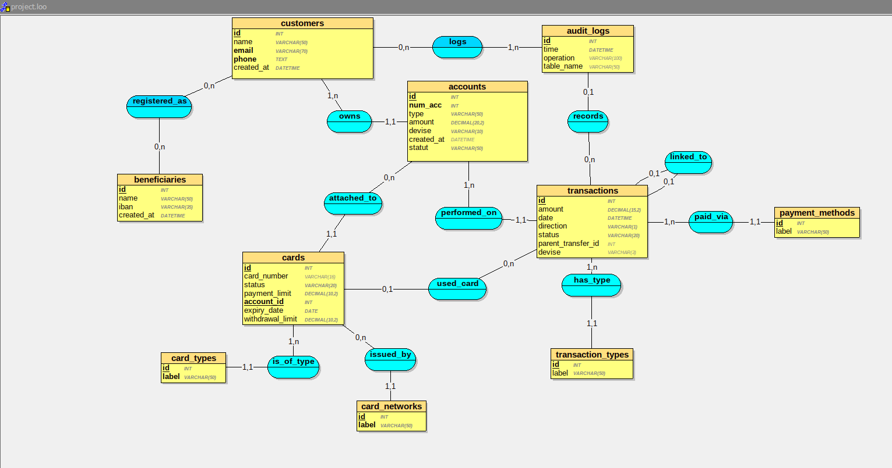

# 🏦 Neobank — Base de Données Relationnelle

> **Projet réalisé en collaboration avec Hugo MARUJO CASANOVA**

Projet SQL complet simulant la base de données d'une néobanque. Il couvre la modélisation, l'insertion de données réalistes, les requêtes analytiques avancées (CTE, fonctions de fenêtrage, ROLLUP), les transactions sécurisées avec gestion de la concurrence, l'optimisation par indexation et l'analyse des plans d'exécution (`EXPLAIN`).

---

## 📚 Table des matières

1. [Modèle Logique de Données (MLD)](#-modèle-logique-de-données-mld)
2. [Structure de la base](#-structure-de-la-base)
3. [Fichiers du projet](#-fichiers-du-projet)
4. [Schéma — `neobank.sql`](#-schéma--neobanksql)
5. [Données — `insert.sql`](#-données--insertsql)
6. [Requêtes analytiques — `analytics.sql`](#-requêtes-analytiques--analyticssql)
7. [Transactions & concurrence — `transactions_concurrence.sql`](#-transactions--concurrence--transactions_concurrencesql)
8. [Indexation — `indexes.sql`](#-indexation--indexessql)
9. [Plans d'exécution — `explain.sql`](#-plans-dexécution--explainsql)
10. [Mise en route](#-mise-en-route)
11. [Technologies](#-technologies)

---

## 🗂 Modèle Logique de Données (MLD)

Le schéma ci-dessous représente le MLD complet de la base de données, conçu avec **Looping** :



Le modèle met en évidence les relations suivantes :

| Relation | Description |
|---|---|
| `customers` ↔ `accounts` | Un client possède 1 à N comptes |
| `customers` ↔ `beneficiaries` | Relation N:N via `registered_as` |
| `accounts` ↔ `cards` | Un compte peut avoir 0 à N cartes |
| `cards` → `card_types` / `card_networks` | Classification des cartes |
| `accounts` ↔ `transactions` | Chaque transaction est rattachée à un compte |
| `transactions` → `transaction_types` / `payment_methods` | Référentiels de type et de moyen de paiement |
| `transactions` ↔ `transactions` | Auto-référence via `parent_transfer_id` (virements) |
| `customers` ↔ `audit_logs` | Traçabilité via la table de jointure `logs` |

---

## 🏗 Structure de la base

La base comprend **12 tables** organisées en trois couches :

### Référentiels
- `transaction_types` — Types de transactions (Virement, Paiement CB, Retrait DAB, etc.)
- `payment_methods` — Moyens de paiement (Carte bancaire, Virement SEPA, Espèces, etc.)
- `card_types` — Types de cartes (Débit, Crédit, Prépayée, Virtuelle)
- `card_networks` — Réseaux de cartes (Visa, Mastercard, American Express, CB)

### Données métier
- `customers` — Clients de la néobanque
- `beneficiaries` — Bénéficiaires de virements
- `registered_as` — Table d'association clients ↔ bénéficiaires
- `accounts` — Comptes bancaires (Courant, Épargne, Joint, PEA)
- `cards` — Cartes bancaires rattachées aux comptes
- `transactions` — Opérations financières

### Traçabilité
- `audit_logs` — Journal d'audit des opérations
- `logs` — Table de jointure clients ↔ audit_logs

---

## 📁 Fichiers du projet

| Fichier | Description |
|---|---|
| `neobank.sql` | Création du schéma (DDL) — tables, contraintes, index |
| `insert.sql` | Insertion de données réalistes (~50 clients, ~100 comptes, ~150 transactions) |
| `analytics.sql` | Requêtes analytiques avancées (CTE, Window Functions, ROLLUP) |
| `transactions_concurrence.sql` | Procédure stockée de virement sécurisé + tests de concurrence |
| `indexes.sql` | Index composites d'optimisation |
| `explain.sql` | Analyse des plans d'exécution (`EXPLAIN FORMAT = TREE / JSON`) |
| `MLD_BDD.png` | Modèle Logique de Données (schéma relationnel) |
| `project.loo` | Fichier source Looping du MLD |

---

## 🔧 Schéma — `neobank.sql`

Ce fichier contient l'ensemble des instructions `CREATE TABLE` définissant le schéma de la base.

**Points notables :**
- Utilisation de `INT UNSIGNED AUTO_INCREMENT` pour les clés primaires
- Contraintes `CHECK` sur les montants (`amount >= 0`, `payment_limit > 0`), les statuts (`'active'`, `'blocked'`, `'closed'`) et les directions (`'D'`, `'C'`)
- Clés étrangères avec politiques `ON DELETE` adaptées (`CASCADE`, `RESTRICT`, `SET NULL`)
- **7 index** déclarés dès la création pour les colonnes les plus filtrées/jointes

```sql
-- Exemple : table transactions avec contraintes et FK
CREATE TABLE transactions (
    id INT UNSIGNED NOT NULL AUTO_INCREMENT PRIMARY KEY,
    amount DECIMAL(15, 2) NOT NULL CHECK (amount > 0),
    direction VARCHAR(1) NOT NULL CHECK (direction IN ('D', 'C')),
    status VARCHAR(20) NOT NULL DEFAULT 'pending'
        CHECK (status IN ('pending', 'completed', 'failed', 'cancelled')),
    parent_transfer_id INT UNSIGNED,
    account_id INT UNSIGNED NOT NULL,
    FOREIGN KEY (parent_transfer_id) REFERENCES transactions (id) ON DELETE SET NULL,
    FOREIGN KEY (account_id) REFERENCES accounts (id) ON DELETE RESTRICT
);
```

---

## 📊 Données — `insert.sql`

Jeu de données réaliste généré par IA comprenant :

| Entité | Volume |
|---|---|
| Clients | 50 |
| Bénéficiaires | 30 |
| Comptes | ~100 (Courant, Épargne, Joint, PEA) |
| Cartes | Multiples par compte |
| Transactions | ~150 (virements, paiements CB, retraits, dépôts, prélèvements) |

Le script nettoie les données existantes (`DELETE` avec `FOREIGN_KEY_CHECKS = 0`) avant de tout réinsérer, garantissant l'idempotence des exécutions.

---

## 📈 Requêtes analytiques — `analytics.sql`

Six requêtes analytiques avancées exploitant les fonctionnalités SQL modernes :

### 1. Top 10 clients par volume de transactions
- **Concepts** : CTE (`WITH`), `RANK()`, agrégation conditionnelle (`CASE WHEN`)
- Classe les clients selon leur volume total, total de dépôts et nombre de transactions

### 2. Détection d'anomalies transactionnelles
- **Concepts** : CTE multiples, `LEFT JOIN`, `CONCAT_WS`
- Applique 4 règles de détection :
  - **R1** — Montant > 3× la moyenne du compte
  - **R2** — Transaction sur un compte bloqué
  - **R3** — Plus de 5 transactions le même jour (rafale)
  - **R4** — Virement débiteur sans contrepartie créditrice

### 3. Analyse mensuelle des dépôts avec fenêtrage
- **Concepts** : `SUM() OVER (ROWS BETWEEN ...)`, `LAG()`, `RANK() PARTITION BY`
- Calcule le cumul glissant, la variation mois par mois et le classement des meilleurs mois

### 4. Agrégation multi-niveaux avec ROLLUP
- **Concepts** : `GROUP BY ... WITH ROLLUP`, `GROUPING()`, `COALESCE`
- Produit des sous-totaux par année, mois et type de compte, puis un grand total

### 5. Classement des comptes par activité
- **Concepts** : `DENSE_RANK()`, `NTILE(4)`, `PERCENT_RANK()`
- Attribue des quartiles d'activité et de solde, ainsi qu'un percentile d'activité

### 6. Tableau croisé type de compte × statut
- **Concepts** : `UNION ALL` pour simuler un ROLLUP personnalisé
- Présente le nombre de comptes, total de transactions, solde moyen et total par axe

---

## 🔄 Transactions & concurrence — `transactions_concurrence.sql`

### Procédure `virement_securise`

Procédure stockée implémentant un virement bancaire conforme aux normes ACID :

```sql
CALL virement_securise(1, 2, 500.00, 'EUR');
```

**Mécanismes de sécurité :**

| Mécanisme | Détail |
|---|---|
| **Verrouillage ordonné** | `SELECT ... FOR UPDATE` dans l'ordre croissant des IDs pour éviter les deadlocks |
| **Validations métier** | Montant positif, comptes différents, comptes actifs, solde suffisant |
| **Atomicité** | `START TRANSACTION` / `COMMIT` avec `EXIT HANDLER FOR SQLEXCEPTION` → `ROLLBACK` |
| **Traçabilité** | Insertion automatique dans `audit_logs` et `logs` |
| **Double écriture** | Transaction débit + transaction crédit liées par `parent_transfer_id` |

### Cas de test inclus
- ✅ Virement nominal (succès)
- ❌ Solde insuffisant
- ❌ Compte destinataire bloqué
- ❌ Montant négatif
- ❌ Même compte source et destination

### Tests de concurrence
- Simulation de deux sessions concurrentes avec `SELECT ... FOR UPDATE`
- Vérification du niveau d'isolation (`@@transaction_isolation`)
- Lecture cohérente dans une transaction (`REPEATABLE READ`)

---

## ⚡ Indexation — `indexes.sql`

Index composites optimisés pour les requêtes analytiques :

| Index | Colonnes | Usage |
|---|---|---|
| `idx_tx_cover_analytics` | `status, account_id, amount, direction, type_id` | Index couvrant pour les requêtes de classement client |
| `idx_tx_depot` | `type_id, direction, status, date, amount, account_id` | Filtre et couverture pour l'analyse des dépôts mensuels |
| `idx_tx_parent_cover` | `parent_transfer_id, direction, status` | Couverture du `LEFT JOIN` de détection des virements sans contrepartie |
| `idx_accounts_statut` | `statut` | Filtre rapide par statut de compte |
| `idx_accounts_type_statut_amount` | `type, statut, amount` | Couverture pour le tableau croisé type × statut |

---

## 🔍 Plans d'exécution — `explain.sql`

Analyse des plans d'exécution des requêtes avec `EXPLAIN FORMAT = TREE` et `EXPLAIN FORMAT = JSON` :

- **Requête 1** — Top 10 clients : matérialisation des CTE, jointures Hash/Nested Loop
- **Requête 2** — Détection d'anomalies : multiples CTE matérialisées, jointures sur index
- **Requête 3** — Dépôts mensuels avec fenêtrage : scan d'index couvrant, tri en mémoire
- **Requête 4** — Analyse comportementale : fenêtrage glissant sur 3 mois

Le fichier contient également des requêtes de diagnostic :
```sql
-- Distribution des statuts de transactions
SELECT status, COUNT(*) AS nb, ROUND(COUNT(*) * 100 / 150, 1) AS pct
FROM transactions GROUP BY status;

-- Index disponibles sur la table transactions
SELECT INDEX_NAME, COLUMN_NAME, CARDINALITY
FROM information_schema.STATISTICS
WHERE TABLE_SCHEMA = 'neobank' AND TABLE_NAME = 'transactions';
```

---

## 🚀 Mise en route

### Prérequis
- **MySQL 8.0+** (ou MariaDB 10.5+)

### Installation

```bash
# 1. Créer la base de données
mysql -u root -p -e "CREATE DATABASE IF NOT EXISTS neobank CHARACTER SET utf8mb4 COLLATE utf8mb4_unicode_ci;"

# 2. Créer le schéma
mysql -u root -p neobank < neobank.sql

# 3. Insérer les données
mysql -u root -p neobank < insert.sql

# 4. (Optionnel) Ajouter les index d'optimisation
mysql -u root -p neobank < indexes.sql

# 5. Exécuter les requêtes analytiques
mysql -u root -p neobank < analytics.sql

# 6. Tester les transactions
mysql -u root -p neobank < transactions_concurrence.sql

# 7. Analyser les plans d'exécution
mysql -u root -p neobank < explain.sql
```

---

## 🛠 Technologies

| Outil | Usage |
|---|---|
| **MySQL 8.0** | SGBD relationnel |
| **Looping** | Modélisation du MLD |
| **SQL** | DDL, DML, CTE, Window Functions, Procédures stockées |

---

<p align="center">
  <em>Projet réalisé par <strong>Merlin COUDOL</strong> & <strong>Hugo MARUJO CASANOVA</strong></em>
</p>
